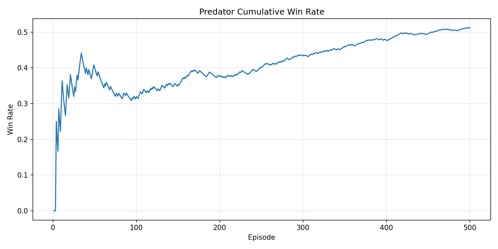
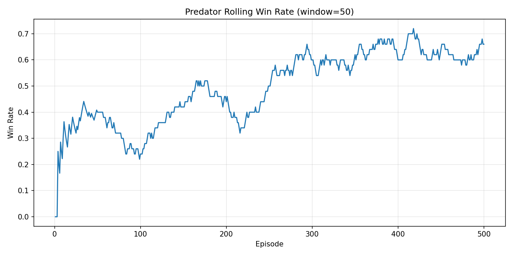

# Spatially Aware Opponent Modeling in 3D Multi-Agent RL

Two predators learn to tag a co-learning prey inside a Project Malmo 3D arena using MAPPO extended with an opponent modeling (OM) head and a spatial voxel encoder.

Existing opponent modeling work targets 2D environments almost exclusively. This project extends OM to a fully 3D setting where agents must reason about spatial structure in three dimensions. Each predator encodes its 5×5×5 voxel visibility window through a 3D CNN, attends over opponent features, and jointly trains an OM head that predicts prey actions via cross-entropy loss. The OM gradients flow back into the shared encoder, shaping the representation toward prey-predictive features. Rollout collection runs across N=2 parallel Malmo workers synchronized via `dist.all_reduce`.

## Architecture

Three parallel branches process each agent's flat 147-dim observation:

- **3D CNN branch** — voxel IDs embedded to 8-dim, two Conv3d layers (8→32→64), AdaptiveAvgPool, linear projection to 64-dim
- **Attention branch** — dot-product attention over opponent feature vectors using the CNN output as query, producing a 32-dim entity vector
- **Stats MLP** — self stats (position, yaw, health) projected to 16-dim

The three outputs are concatenated and projected to a shared 128-dim encoding. The actor backbone and OM head both read from this encoding. The OM head is a single-layer MLP (128→64) predicting prey move and turn logits.

## Results

Evaluated over 500 episodes against a simultaneously co-learning prey.

| Method | Rolling WR (final) | Cumulative WR |
|---|---|---|
| **MAPPO + OM (ours)** | **~0.65** | **~0.51** |
| MARLeOM | ~0.50 | ~0.35 |
| OMIS (seen prey) | ~1.00 | ~0.99 |
| OMIS (unseen prey) | ~0.63 | ~0.77 |
| MAPPO (w/o Voxel Encoding) | ~0.26 | ~0.31 |

OMIS achieves near-perfect win rates on seen prey but is trained against a fixed scripted policy — that advantage disappears against a co-evolving opponent. MARLeOM underperforms because its MCTS-based planning assumes discrete 2D state transitions, which break in 3D continuous-observation settings. Removing the voxel encoder cuts the rolling win rate by more than half, confirming that spatially-aware encoding is necessary for OM in this setting.

### Cumulative Win Rate



### Rolling Win Rate (50-episode window)



### Distributed Training Speedup

Parallel rollout collection with N=2 workers reduces wall-clock time from 14.67h to 9.13h on an RTX 3060 — a **1.61× speedup** over single-environment training.

## Documentation

See [PROJECT.md](PROJECT.md) for project structure, execution instructions, and design notes.

---

## Project Malmo Setup

### Prerequisites

Download and install these before anything else:

- [Miniconda (Windows 64-bit)](https://repo.anaconda.com/miniconda/Miniconda3-latest-Windows-x86_64.exe)
- [Java 8 JDK (Windows x64 .msi)](https://adoptium.net/temurin/releases/?version=8) — pick the `.msi` installer
- [Malmo 0.37.0 (Windows 64-bit with Boost + Python 3.7)](https://github.com/microsoft/malmo/releases/tag/0.37.0) — download `Malmo-0.37.0-Windows-64bit_withBoost_Python3.7.zip`

### 1. Extract Malmo

Extract the zip to `C:\Malmo`.

### 2. Set JAVA_HOME

Open cmd and run:

```cmd
setx JAVA_HOME "C:\jdk8"
```

Replace `C:\jdk8` with wherever you installed the JDK. Close and reopen cmd after.

### 3. Create Conda Environment

```cmd
conda create -n marl-malmo python=3.7
conda activate marl-malmo
```

### 4. Link Malmo Python Bindings

```cmd
echo C:\Malmo\Python_Examples > C:\Users\<YOUR_USERNAME>\miniconda3\envs\marl-malmo\Lib\site-packages\malmo.pth
```

Replace `<YOUR_USERNAME>` with your Windows username.

Verify it works:

```cmd
python -c "import MalmoPython; print('Malmo OK')"
```

### 5. Build Minecraft Client

```cmd
cd /d C:\Malmo\Minecraft
gradlew.bat setupDecompWorkspace
```

This takes ~5-15 mins on first run. Once done, launch with:

```cmd
gradlew.bat runClient
```

You should see Minecraft 1.11.2 launch with Forge and 5 mods active.

### 6. Install Python Dependencies

```cmd
conda activate marl-malmo
pip install -r requirements.txt
```

---

## Notes

- Always run with `marl-malmo` conda env activated
- `cd` across drives in cmd requires the `/d` flag: `cd /d C:\Malmo\Minecraft`
- The `gradlew.bat setupDecompWorkspace` step only needs to be run once
- Warnings about ForgeGradle version and MC 1.11 mappings during build are harmless
